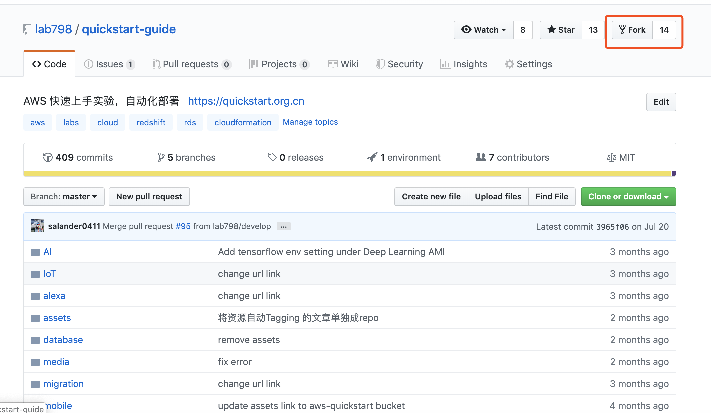

# 如何提交文档到Lab798

本文主要介绍提交文档到[lab798](https://github.com/lab798)的标准流程。
在提交前，请务必检查该文章是否符合lab798的文章要求。

## 目录
1. [Lab798对提交文档的要求](#Lab798对提交文档的要求)
1. [如何提交文章到Lab798](#如何提交文章到Lab798)

## Lab798对提交文档的要求

本章节介绍lab798对author以及reviewer的要求。本章节最后有文档example供参考。

### **对Author的要求**    
作为文档撰写者，在提交到lab798之前，请保证文章满足以下要求。
1. **技术角度** ：确保技术方案的可行性。此为最基础也最必要的部分。
1. **格式要求**：如果初版写在word/quip上，请先转写为Markdown。建议先阅读[markdown教程](http://www.markdown.cn/)以保证格式的正确性。
1. **必要章节**：**标题**，**目的** ，**适用场景** ,**总结** 。技术方案需要添加**架构图**方便reader的理解。
1. **必要描述**：对每个子章节，需要对本章节内容做大概的介绍，需要使reader大概知晓每个章节的任务。
1. **敏感信息**： 查看是否有暴露任何token或者敏感信息。如有，一定要进行删除或者马赛克处理
1. **选择章节**: 参考资料，如何销毁资源，troubleshooting。这部分不做强制要求，但是为了文章的完整性，**建议填写** 。
1. **Reviewer**: 需要找一位SA对文章进行技术的验证与格式上的review。

### **对Reviewer的要求**    
作为reviewer，需要对格式，内容两大方面进行review。技术的可行性验证是最基础以及最必要的环节。以下为reviewer具体的responsibility。
1. **内容方面** 。包括但不局限于
   - 内容验证：验证文档所述的技术方案是否work，按照作者的guide能否成功复现。如不能，与作者沟通缺失的环节。
   - 表述不够清晰：reviewer作为普通阅读者，有没有难以看懂的地方。如果不清楚作者用意，需要与作者沟通
   - 表述错误：由于笔误导致的错误，如谐音字，duplicate，wrong content
   - 内容的重复：比如对于某内容反复的描述（如一段描述多次出现等）
   - 查看是否有暴露任何token或者敏感信息。如有，一定要提醒进行删除或者马赛克处理
   - 文章结构：文章顺序以及结构是否简单易懂，符合逻辑。比如标题与子标题之间的递进关系是否合乎逻辑，每个章节是否在符合逻辑的正常语序中。
   - 是否有完整的摘要，结论，场景这些章节。

1. **修改格式** 。包括但不局限于
   - 子段落的序号，是否序号连续且正确
   - 段落缩进：图片，code block的缩进，是否正常且清晰
   - 标题：是否与正文混在一起，是否有加粗（如必要），小标题与大标题的区分
   - 排版：是否出现乱序等
   - 超链接：是否有对应的超链接，超链接是否正确，是否以**文字的形式**而不是纯link连接过去，比如参考这个[外链例子](http://www.markdown.cn/)

1. **Final Review**：在完成所有的修改之后，需要进行二次final review
   - 完整的阅读整篇文章，再次检查上述的所有项目是否正确，是否有缺漏或者二次修改错误的地方
   - 作为reviewer，如果对内容有补充，需要额外的检查自己补充的这些是否正确

### **Lab798 well-written example**
1. [AWS STS, OpenID Connect 实现 S3 精细化权限控制](https://github.com/lab798/aws-s3-sts-openid-lab)
1. [AWS Alexa Workshop: Smart Home](https://github.com/lab798/aws-alexa-workshop-smarthome)。在目录下包含有很多子文档，也可点击相应链接做参考。

## 如何提交文章到Lab798
1. Author开SIM到[lab798 Folder](https://sim.amazon.com/issues/search?q=status:Open%20in:4b47d75a-a845-48d5-ba89-88a92b2c2684&sort=lastUpdatedDate%20desc&mode=auto),点击跳转到[模板]()。需要填写文章地址，reviewer，repo名称等信息。
1. Lab798收到SIM会在lab798开启对应的repo并留言通知Author地址。
1. Author点击此地址，folk此repo到自己的GitHub中，进行内容的更新，并提醒reviewer进行review。
   
1. Reviewer完成review后在SIM下留言说明
1. Author进行pull request. 
    
   head选择origin repo & branch，base选择你的target repo & branch
   
1. Lab798管理员Approve此request。内容提交完成。
